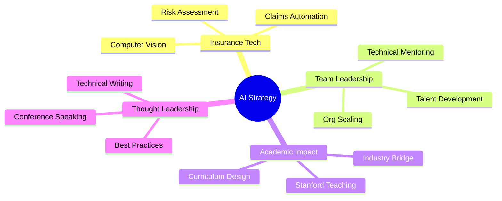

# 👋 Jeremy Gu | AI & Data Science Executive

  

## 🎯 Executive Summary

**Director of Data Science** with **12+ years** leading AI/ML initiatives across insurance, e-commerce, transportation, and advertising sectors. Currently architecting proprietary **RAG/LLM/CV platforms** at SageSure, replacing third-party vendors and **saving millions** in operational costs.

**Career Progression:** Amazon → Uber (IPO readiness) → Stitch Fix ($100M ad budget) → Shipt (Built 15-person team) → SageSure (Current)

---

## 🏢 Current Role: Director of Data Science @ SageSure

Leading **6 ML engineers** implementing AI strategy across the complete home insurance lifecycle:

- 🤖 **Knowledge-based chatbot** reducing manual processing time by **40%**
- 📸 **Computer vision models** for hurricane damage assessment from aerial imagery  
- ⚡ **Real-time ML optimization** improving claims assignment accuracy by **25%**
- 🏗️ **AWS-based RAG/LLM platforms** replacing costly third-party vendors

---

## 📊 Leadership Impact & Key Achievements

<table>
<tr>
<td width="50%">

### 💰 Business Impact
- **$2-3M annually** saved through fraud detection at Shipt
- **20% ROAS improvement** via personalized ads at Stitch Fix  
- **$100M/year** ad budget management across channels
- **3.1M new users** acquired via ML systems at Uber

</td>
<td width="50%">

### 👥 Team Leadership
- **15-person team** built from 1 at Shipt (Director level)
- **5 data scientists** managed at Uber (Tech Lead Manager)
- **13 engineers/analysts** led cross-functionally for IPO
- **700+ educators** trained in AI/LLM best practices

</td>
</tr>
</table>

---

## 🎓 Academic Excellence & Teaching

| Institution | Role | Achievement |
|-------------|------|-------------|
| **Stanford University** | Executive Program Graduate & Instructor | SEP '25 + **4.9/5.0** rating |
| **University of San Francisco** | Adjunct Professor | Teaching Data Streaming (Kafka, MLflow) |
| **University of Washington** | MS Statistics | Statistical Learning Specialization |

---

## 🛠️ Technical Leadership & Architecture

| **Domain** | **Technologies & Platforms** | **Business Impact** |
|------------|------------------------------|-------------------|
| **AI/ML Strategy** | Python, TensorFlow, PyTorch, LLM/RAG | Built fraud detection saving $2-3M annually |
| **Cloud Architecture** | AWS (EC2, S3, Redshift), Azure, Databricks | Scaled systems for 50k+ daily transactions |
| **Data Engineering** | Kafka, Spark, Airflow, MLflow | Reduced processing time from 2hr to 40min |
| **Analytics Platforms** | Statistical Experimentation, A/B Testing | 20% ROAS improvement, 3.1M user acquisition |
| **Team Leadership** | Agile, Cross-functional Management | Built 15-person team from scratch |

 

 

----

## 📈 GitHub Activity & Contributions

---

## 🎤 Thought Leadership & Publications

### **Recent Speaking Engagements**
- 🗣️ **Bloomberg NYC** - "The Value of Data: Emerging Technologies" (Sept 2018)
- 📚 **UC San Diego** - Supply Chain Analytics Guest Lecture (May 2024)  
- 🎓 **University of Washington** - Data Science in Logistics (March 2024)

### **Technical Publications**
- 📖 [**Under the Hood of Uber's Experimentation Platform**](https://www.uber.com/en-SE/blog/xp/) - Uber Engineering Blog
- 📊 **Mixture Models for Blood Flow Velocity** - Journal of Ultrasound
- 📰 **Career Development Panel** - American Statistical Association

---

## 🌟 Professional Activities & Recognition

| Role | Organization | Years | Impact |
|------|--------------|-------|--------|
| **Advisory Board** | Data Science Conference | 2016-2020 | Event strategy & speaker curation |
| **Advisory Board** | AI World Conference | 2018-2020 | Business strategy sessions |
| **Elected Officer** | American Statistical Association | 2015-2018 | Bay Area & Puget Sound chapters |

---

## 🚀 Current Focus Areas

---

## 📊 Executive Metrics Dashboard

**📈 Career Progression** | **🎯 Current Impact** | **🏆 Recognition**
:---:|:---:|:---:
12+ Years Leadership | 6 ML Engineers Led | Stanford SEP Graduate
5 Major Companies | $M+ Cost Savings | 4.9/5.0 Teaching Rating
700+ Educators Trained | 25% Efficiency Gains | Industry Speaker

---

## 🤝 Let's Connect

> **"Translating AI strategy into executive decision-making frameworks"**

I'm passionate about scaling data science organizations and driving AI adoption in enterprise environments. Always open to discussing:

- 🎯 **Strategic AI implementation** in traditional industries
- 👥 **Building and scaling** high-performing data science teams  
- 🎓 **Executive education** in data-driven decision making
- 🤝 **Advisory opportunities** in AI/ML startups

**📍 San Francisco Bay Area** | **💼 Open to Meet People with Similar Mindsets**

---

  
  
  *Last updated: Automatically via GitHub Actions • View source in `.github/workflows/`*

