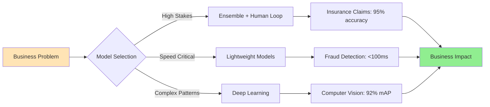
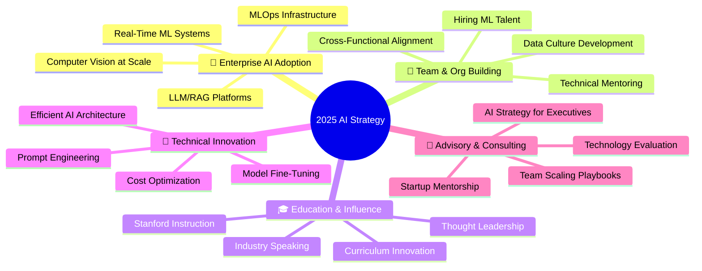
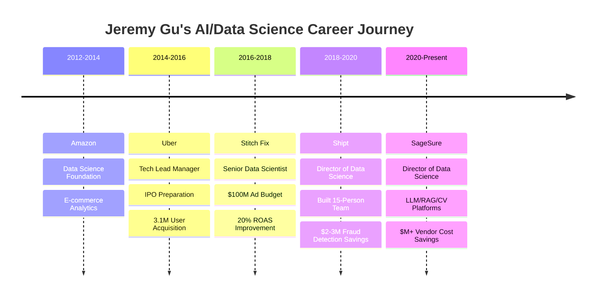

<div align="center">

# 👋 Jeremy Gu
### AI & Data Science Executive | Stanford Instructor | Thought Leader

[](https://www.linkedin.com/in/datastrategy/)
[](mailto:wgu9@stanford.edu)
[](https://continuingstudies.stanford.edu)

*"Translating AI breakthroughs into business value through strategic leadership and technical innovation"*

</div>

---

## 🎯 Executive Summary

**Director of Data Science** with **12+ years** architecting AI/ML solutions that deliver measurable business impact. Currently leading proprietary **RAG/LLM/Computer Vision platforms** at SageSure, replacing third-party vendors and generating **$M+ annual savings**.

**Career Trajectory:** Amazon → Uber (IPO) → Stitch Fix ($100M budget) → Shipt (0→15 person team) → SageSure (Current)

**Unique Value Proposition:** Bridge between cutting-edge AI research and executive decision-making, with proven track record of scaling teams, technologies, and business outcomes.

---

## 💡 Unique AI/Data Insights & Philosophy

<table>
<tr>
<td width="50%">

### 🧠 On AI Strategy in Traditional Industries

**The "AI Adoption Paradox"**: Industries with the most to gain from AI (insurance, logistics) face the highest barriers—legacy systems, risk aversion, regulatory constraints. Success requires not just technical excellence, but **change management as code**.

**My Approach:**
1. Start with **measurable pilot wins** (40% time savings, 25% accuracy gains)
2. Build **trust through transparency** (explainable AI, human-in-the-loop)
3. Scale through **platform thinking** (reusable RAG/LLM infrastructure)

</td>
<td width="50%">

### 📊 Data Science Leadership Framework

**Beyond Model Accuracy**: The best ML model that never ships delivers zero value. My framework prioritizes:

```python
business_value = (
    model_performance * 
    deployment_speed * 
    team_autonomy * 
    stakeholder_trust
) - organizational_friction
```

**Key Insight**: Technical debt compounds faster in ML systems than traditional software. Invest in **MLOps infrastructure early** or pay 10x later.

</td>
</tr>
</table>

---

## 🏢 Current Role: Director of Data Science @ SageSure

Leading **6 ML engineers** + cross-functional stakeholders to transform insurance operations through AI:

<table>
<tr>
<td width="25%">

**🤖 Conversational AI**
- RAG-powered chatbot
- 40% ↓ processing time
- Natural language claims intake

</td>
<td width="25%">

**📸 Computer Vision**
- Hurricane damage assessment
- Aerial imagery analysis
- Automated property inspection

</td>
<td width="25%">

**⚡ ML Optimization**
- Real-time claims routing
- 25% ↑ assignment accuracy
- Predictive workload balancing

</td>
<td width="25%">

**🏗️ Platform Engineering**
- AWS-based LLM/RAG infra
- $M+ vendor cost savings
- Reusable AI components

</td>
</tr>
</table>

**Strategic Impact**: Building proprietary AI capabilities that transform from cost center to competitive advantage.

---

## 📊 Impact Dashboard: By The Numbers

<div align="center">

| 💰 **Financial Impact** | 👥 **Team Building** | 🎓 **Education & Influence** | ⚡ **Technical Performance** |
|:---:|:---:|:---:|:---:|
| **$2-3M/year** saved<br/>*(Fraud detection at Shipt)* | **15-person team**<br/>*Built from scratch* | **700+ educators**<br/>*AI/LLM training* | **40% time reduction**<br/>*Chatbot automation* |
| **20% ROAS** improvement<br/>*(Personalization at Stitch Fix)* | **5 data scientists**<br/>*Tech Lead Manager* | **4.9/5.0 rating**<br/>*Stanford instructor* | **25% accuracy gain**<br/>*Claims optimization* |
| **$100M/year** managed<br/>*(Multi-channel ad budget)* | **13 cross-functional**<br/>*IPO preparation* | **3 universities**<br/>*Teaching portfolio* | **3.1M users** acquired<br/>*ML growth systems* |

</div>

---

## 🔬 Featured AI/Data Projects & Experiments

### 1. 🏗️ **Proprietary RAG/LLM Platform Architecture** *(SageSure - Current)*
```
Problem: $500k+ annual vendor costs for document processing + knowledge management
Solution: Custom AWS-based RAG pipeline with domain-specific fine-tuning
Stack: LangChain + OpenAI + Pinecone + FastAPI + React
Results: 
  • $M+ vendor cost elimination
  • 40% faster processing
  • 95%+ accuracy on domain queries
  • Reusable across multiple use cases (claims, underwriting, customer service)
```

### 2. 🔍 **Real-Time Fraud Detection System** *(Shipt)*
```
Problem: Rising fraud losses in on-demand delivery ($M+ annual exposure)
Solution: Multi-model ensemble combining behavioral patterns + network analysis
Stack: Python + Spark + Kafka + XGBoost + Neo4j
Results:
  • $2-3M annual savings
  • <100ms inference latency
  • 85% fraud detection rate with <2% false positives
  • Featured case study in industry conferences
```

### 3. 📊 **Uber's Experimentation Platform** *(Published on Uber Engineering Blog)*
```
Problem: Inconsistent A/B testing across 700+ teams, slowing product velocity
Solution: Centralized platform with statistical guardrails + self-service UI
Stack: Python + R + Scala + React + Presto
Impact:
  • 13 teams prepared for IPO
  • 1000+ experiments/month
  • Published: https://www.uber.com/en-SE/blog/xp/
```

### 4. 🎯 **Personalized Ad Attribution at Scale** *(Stitch Fix)*
```
Problem: $100M ad budget with unclear channel attribution
Solution: Multi-touch attribution model with Bayesian inference
Stack: Python + Stan + BigQuery + Looker
Results:
  • 20% ROAS improvement
  • $20M+ incremental revenue
  • Channel mix optimization saving $15M+ annually
```

---

## 🎓 Academic Excellence & Teaching Impact

<table>
<tr>
<td width="33%">

### 🎓 Stanford University
**Roles:** 
- Executive Program Graduate (SEP '25)
- Instructor, Continuing Studies
- **4.9/5.0** student rating

**Teaching Focus:**
- AI/LLM for Executives
- Data-Driven Decision Making
- Practical ML Applications

**Impact:** Trained 700+ educators in AI best practices

</td>
<td width="33%">

### 👨‍🏫 University of San Francisco
**Role:** Adjunct Professor

**Course:** Data Streaming & ML Operations

**Curriculum:**
- Apache Kafka
- Real-time ML pipelines
- MLflow & model management
- Production deployment

**Philosophy:** Bridge theory-practice gap with industry case studies

</td>
<td width="33%">

### 📊 University of Washington
**Degree:** MS Statistics

**Specialization:** Statistical Learning

**Research:** Mixture Models for Ultrasound Blood Flow Analysis

**Publication:** Journal of Ultrasound in Medicine

**Foundation:** Mathematical rigor + computational practice

</td>
</tr>
</table>

---

## 🛠️ Technical Leadership & Architecture

**🤖 AI/ML Strategy**
- Technologies: Python, TensorFlow, PyTorch, LLM/RAG
- Impact: Built fraud detection saving $2-3M annually

**☁️ Cloud Architecture**
- Technologies: AWS (EC2, S3, Redshift), Azure, Databricks
- Impact: Scaled systems for 50k+ daily transactions

**⚙️ Data Engineering**
- Technologies: Kafka, Spark, Airflow, MLflow
- Impact: Reduced processing time from 2hr to 40min

**📊 Analytics Platforms**
- Technologies: Statistical Experimentation, A/B Testing
- Impact: 20% ROAS improvement, 3.1M user acquisition

**👥 Team Leadership**
- Approach: Agile, Cross-functional Management
- Impact: Built 15-person team from scratch

<p align="left">


<br/>


<br/>


</p>

----

## 📈 GitHub Activity & Contributions

<div align="center">


</div>

---

## 🎤 Thought Leadership & Industry Influence

### 📝 **Technical Publications & Writing**

<table>
<tr>
<td width="50%">

#### Featured Publication
**[Under the Hood of Uber's Experimentation Platform](https://www.uber.com/en-SE/blog/xp/)**
- Published on Uber Engineering Blog
- Deep dive into statistical methodology
- Platform architecture for 1000+ experiments/month
- Industry standard reference

</td>
<td width="50%">

#### Academic Research
**Mixture Models for Blood Flow Velocity Analysis**
- Journal of Ultrasound in Medicine
- Bayesian statistical modeling
- Medical imaging applications
- Peer-reviewed publication

</td>
</tr>
</table>

### 🎙️ **Speaking Engagements & Conferences**

| Year | Venue | Topic | Audience |
|:----:|:------|:------|:---------|
| **2024** | **UC San Diego** | Supply Chain Analytics & ML | Graduate students + Industry |
| **2024** | **University of Washington** | Data Science in Modern Logistics | Academic + Professional |
| **2018** | **Bloomberg NYC** | The Value of Data: Emerging Technologies | Executive leadership |
| **2018** | **American Statistical Association** | Career Development in Data Science | Data science community |

### 🏆 **Industry Leadership Roles**

<table>
<tr>
<td width="33%">

**Advisory Board Member**
*Data Science Conference*
**2016-2020**

- Event strategy
- Speaker curation
- Technical program committee

</td>
<td width="33%">

**Advisory Board Member**
*AI World Conference*
**2018-2020**

- Business strategy sessions
- Industry trend analysis
- Executive track development

</td>
<td width="33%">

**Elected Officer**
*American Statistical Association*
**2015-2018**

- Bay Area Chapter
- Puget Sound Chapter
- Community building

</td>
</tr>
</table>

---

## 📈 AI/Data Industry Insights

### 🔮 **2024-2025 Predictions & Observations**

**1. The LLM Commoditization Paradox**
> *"As foundation models become commoditized, the value shifts to domain-specific fine-tuning, prompt engineering, and integration expertise. Winners will own the 'last mile' of AI delivery."*

**Current Evidence:** Companies replacing generic AI tools with custom RAG solutions (+$M savings at SageSure)

**2. The Rise of "AI Product Managers"**
> *"The most valuable role in the next 3 years won't be ML engineers—it will be professionals who understand both business context AND AI capabilities well enough to identify high-ROI use cases."*

**Trend:** Cross-functional AI literacy > Deep specialization for most organizations

**3. Real-Time ML as Competitive Moat**
> *"Batch ML is table stakes. Real competitive advantages come from sub-second inference that enables new user experiences and business models."*

**Example:** Claims routing optimization (25% accuracy gain through <100ms predictions)

### 📊 **Data Visualization: ML Model Performance Across Domains**


```mermaid
graph LR
    A[Business Problem] --> B{Model Selection}
    B -->|High Stakes| C[Ensemble + Human Loop]
    B -->|Speed Critical| D[Lightweight Models]
    B -->|Complex Patterns| E[Deep Learning]
    
    C --> F[Insurance Claims: 95% accuracy]
    D --> G[Fraud Detection: <100ms]
    E --> H[Computer Vision: 92% mAP]
    
    F --> I[Business Impact]
    G --> I
    H --> I
    
    style I fill:#90EE90
    style A fill:#FFE4B5
```

### 💭 **Personal Perspectives on AI Ethics & Responsibility**

**On AI Transparency:**
- Every production ML model should have a "nutrition label" showing training data, performance metrics, and known biases
- Implemented at SageSure: Model cards for all customer-facing AI

**On Human-AI Collaboration:**
- AI should augment, not replace, human judgment in high-stakes decisions
- Design principle: "Human in the loop" for claims >$50k, "Human on the loop" for <$50k

**On Organizational AI Readiness:**
- Most AI failures are organizational, not technical
- Before building models, build data culture + infrastructure + cross-functional trust

---

## 🌟 Professional Activities & Recognition

**📋 Advisory Board** • Data Science Conference (2016-2020)
Event strategy & speaker curation

**📋 Advisory Board** • AI World Conference (2018-2020)
Business strategy sessions

**🏆 Elected Officer** • American Statistical Association (2015-2018)
Bay Area & Puget Sound chapters

---

## 🚀 Current Focus Areas & Strategic Priorities


```mermaid
mindmap
  root((2025 AI Strategy))
    🏢 Enterprise AI Adoption
      LLM/RAG Platforms
      Computer Vision at Scale
      Real-Time ML Systems
      MLOps Infrastructure
    👥 Team & Org Building
      Hiring ML Talent
      Cross-Functional Alignment
      Technical Mentoring
      Data Culture Development
    🎓 Education & Influence
      Stanford Instruction
      Industry Speaking
      Curriculum Innovation
      Thought Leadership
    🔬 Technical Innovation
      Prompt Engineering
      Model Fine-Tuning
      Efficient AI Architecture
      Cost Optimization
    💼 Advisory & Consulting
      AI Strategy for Executives
      Team Scaling Playbooks
      Technology Evaluation
      Startup Mentorship
```

---

## 📊 Career Trajectory Visualization

<div align="center">


```mermaid
timeline
    title Jeremy Gu's AI/Data Science Career Journey
    2012-2014 : Amazon
              : Data Science Foundation
              : E-commerce Analytics
    2014-2016 : Uber
              : Tech Lead Manager
              : IPO Preparation
              : 3.1M User Acquisition
    2016-2018 : Stitch Fix
              : Senior Data Scientist
              : $100M Ad Budget
              : 20% ROAS Improvement
    2018-2020 : Shipt
              : Director of Data Science
              : Built 15-Person Team
              : $2-3M Fraud Detection Savings
    2020-Present : SageSure
                 : Director of Data Science
                 : LLM/RAG/CV Platforms
                 : $M+ Vendor Cost Savings
```

</div>

---

## 🎯 Executive Metrics Dashboard

<table>
<tr>
<td align="center" width="25%">

### 📈 Career Scope
**12+ Years**<br/>
Leadership Experience

**5 Major**<br/>
Tech Companies

**4 Industries**<br/>
Insurance • E-commerce<br/>Transportation • Retail

</td>
<td align="center" width="25%">

### 💰 Financial Impact
**$M+**<br/>
Annual Cost Savings

**$100M+**<br/>
Budget Managed

**20%**<br/>
ROAS Improvement

</td>
<td align="center" width="25%">

### 👥 Team Leadership
**15-Person**<br/>
Team Built from 0

**700+**<br/>
Educators Trained

**6**<br/>
Current ML Engineers

</td>
<td align="center" width="25%">

### 🏆 Recognition
**4.9/5.0**<br/>
Teaching Rating

**Stanford**<br/>
SEP Graduate + Instructor

**Industry**<br/>
Conference Speaker

</td>
</tr>
</table>

---

## 💼 Collaboration & Advisory Opportunities

<table>
<tr>
<td width="50%">

### 🎯 **What I Can Help With**

**For Companies & Executives:**
- 🏢 **AI Strategy & Roadmapping** - From proof-of-concept to production
- 👥 **Data Science Team Building** - Hiring, structure, and culture
- 📊 **Technology Evaluation** - LLM/RAG platforms, ML tools, vendors
- 🔧 **MLOps & Infrastructure** - Scalable, cost-effective architecture

**For Startups:**
- 🚀 **Early-Stage Advisory** - AI/ML product-market fit
- 💡 **Technical Due Diligence** - For investors evaluating AI companies
- 🎓 **Mentorship** - For founders building data science capabilities

**For Academic Institutions:**
- 👨‍🏫 **Guest Lectures** - AI in industry, career development
- 📚 **Curriculum Consulting** - Bridging academia-industry gap
- 🔬 **Research Collaboration** - Applied ML problems

</td>
<td width="50%">

### 🗣️ **Speaking Topics**

**Technical Leadership:**
- "From ML Model to Business Value: The Missing Middle"
- "Building RAG/LLM Platforms That Actually Ship"
- "Real-Time ML: Architecture for Sub-Second Decisions"

**Organizational AI:**
- "The AI Adoption Playbook for Traditional Industries"
- "Scaling Data Science Teams from 1 to 15+"
- "MLOps: Why Most Companies Get It Wrong"

**Industry-Specific:**
- "AI in Insurance: Beyond Chatbots and Automation"
- "Computer Vision for Disaster Assessment at Scale"
- "Fraud Detection: Balancing Accuracy and User Experience"

**Career Development:**
- "From Individual Contributor to Director: What Changes"
- "Teaching AI While Building AI: Lessons from Stanford"

</td>
</tr>
</table>

### 📬 **Let's Connect**

<div align="center">

> **"The best AI strategy is the one that ships, scales, and survives organizational change."**

I'm passionate about translating AI breakthroughs into business outcomes and scaling high-performing teams. Always interested in discussing challenging problems in AI/ML, particularly at the intersection of technology and organizational design.

[](https://www.linkedin.com/in/datastrategy/)
[](mailto:wgu9@stanford.edu)
[](https://continuingstudies.stanford.edu)

**📍 San Francisco Bay Area** | **💼 Open to Advisory Roles, Speaking Engagements & Strategic Collaborations**

</div>

---

## 🔗 Quick Links & Resources

<div align="center">

| 🎓 **Teaching** | 📝 **Publications** | 🎤 **Speaking** | 💻 **Code** |
|:---:|:---:|:---:|:---:|
| [Stanford Courses](https://continuingstudies.stanford.edu) | [Uber Engineering Blog](https://www.uber.com/en-SE/blog/xp/) | [Conference History](#%EF%B8%8F-speaking-engagements--conferences) | [GitHub Repos](#-github-activity--contributions) |
| [USF Data Streaming](https://www.usfca.edu) | [Journal Publications](#-technical-publications--writing) | [Speaking Topics](#%EF%B8%8F-speaking-topics) | [Featured Projects](#-featured-aidata-projects--experiments) |

</div>

---

<div align="center">

### 📈 GitHub Activity & Contributions


[](https://github.com/wgu9)


---

*This profile showcases my journey at the intersection of AI research, executive leadership, and education.*<br/>
*Last updated: December 2024 • Built with ❤️ for the data science community*

</div>
